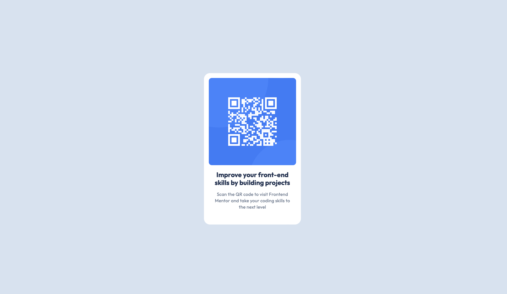

# Frontend Mentor - QR code component solution

This is a solution to the [QR code component challenge on Frontend Mentor](https://www.frontendmentor.io/challenges/qr-code-component-iux_sIO_H). Frontend Mentor challenges help you improve your coding skills by building realistic projects.

## Table of contents

- [Overview](#overview)
  - [Screenshot](#screenshot)
  - [Links](#links)
- [My process](#my-process)
  - [Built with](#built-with)
  - [What I learned](#what-i-learned)
  - [Continued development](#continued-development)
  - [Useful resources](#useful-resources)
- [Author](#author)
- [Acknowledgments](#acknowledgments)

## Overview

A simple card component with a QR code

### Screenshot

### Links

- Live Site URL: [Add live site URL here](https://carson-haskell.github.io/qr-code-component/)

### Built with

- CSS custom properties
- Flexbox
- HTML/CSS

### What I learned

Implemented Figma for the first time to follow specific styles.

## Author

- Website - [Add your name here](https://portfolio-website-sandy-alpha-78.vercel.app)
- Frontend Mentor - [@carson-haskell](https://www.frontendmentor.io/profile/carson-haskell)
